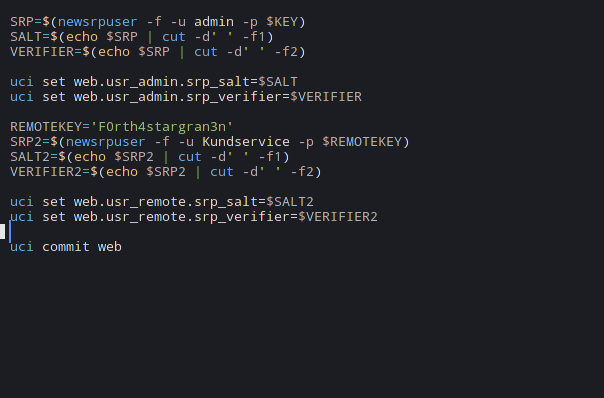
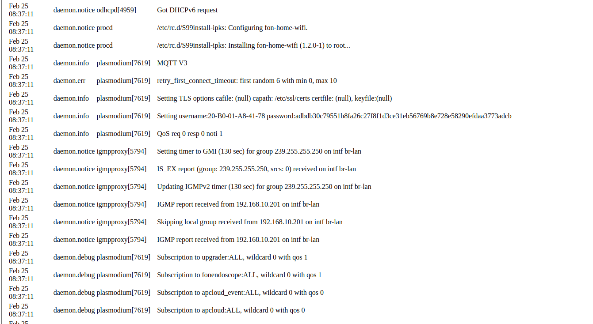

# TG799vacXTREAM-18.1-Champagne

On my new blog you might find other things for my projects as well in future: 

	https://nr1.nu

This wiki wont be as big as the one from Telia but I just got one of those (actually i wanted a telia one) but yeah, there is not much info 
about this router online I figured out and after few hours of playing around there is some stuff that I want to share.
The router seems to be more secured then telias but I doubt, they store passwords in plaintext aswell. 

There is horrible stuff about Telenors as well and this repo will be updated now and then.

# First out, Telenors password is also stored in plaintext, 

    Default Login: Kundservice 
    Default Password: F0rth4stargran3n

For add the SRP2 do as it say:

    newsrpuser -f  -u Kundservice -p F0rth4saragran3n
    S=$(echo $SRP2|cut -d' ' -f1)
    V=$(echo $SRP2|cut -d' ' -f2)
	
And now just add it to settings:

    uci set web.usr_remote.srp_salt=${S}
    uci set web.usr_remote.srp_lt=${V}
    uci commit
	 
Done 

How come nobody else have found this earlier or leaked this? The Router has been used since 2015, noob ISP. 

# Logviewer

First thing that might help anyone that does know how to get logviewer shown up, passwords are stored here also for variuos features :) 

